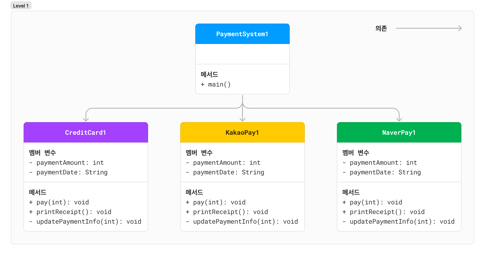

## 간단한 결제 시스템 개발하기 - LEVEL 1

`CreditCard`, `KakaoPay`, `NaverPay`는 모두 구현되어 있습니다.  
각 클래스의 멤버 변수(필드)와 메서드를 살펴보고 어떤 기능이 있는지 확인해 보세요. **(많은 코드가 중복된다는 것도 확인해 보세요!)**

### 구조

### 결제 처리 클래스들 (`CreditCard`, `KakaoPay`, `NaverPay`)

#### 멤버 변수

- `int paymentAmount`: 결제 금액
- `String paymentDate`: 결제 날짜•시간

#### 메서드

- `void pay(int paymentAmount)`: 결제 진행
- `void printReceipt()`: 결제 영수증 출력
- `void updatePaymentInfo(int paymentAmount)`: 결제 정보 업데이트 (결제 금액과 결제 시간을 갱신)

### 직접 구현해 봅시다!

**이제 아래의 출력 예제를 보고 `PaymentSystem1`의 `main` 메서드를 완성하세요!**

