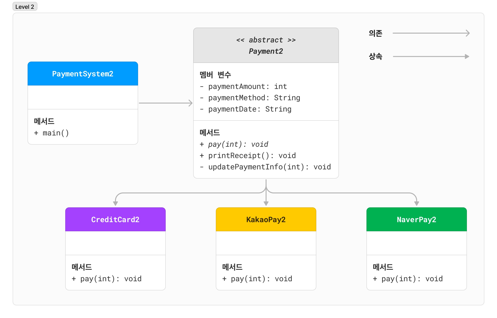

## 간단한 결제 시스템 개발하기 - LEVEL 2

LEVEL1에서 각 결제 처리 클래스들에 많은 코드 중복이 존재할 뿐 아니라, `PaymentSystem1`의 `main` 메서드에서 결제 처리 클래스를 생성하고 결제 진행,
영수증 출력 등의 작업을 할 때 객체만 바뀌고 동일한 코드가 계속 반복된다는 것을 느끼실 수 있을 것입니다.

**이제 추상 클래스를 도입하여 중복을 제거하고 더 유연한 구조의 코드를 작성해 봅시다!**   
덤으로 LEVEL1에서의 결제 처리 클래스들에 비해 LEVEL2에서의 결제 처리 클래스들의 코드가 얼마나 간결해졌는지도 확인해 보세요.

### 구조

### `Payment` 추상 클래스

#### 멤버 변수

- `int paymentAmount`: 결제 금액
- `String paymentMethod`: 결제 방식
- `String paymentDate`: 결제 날짜•시간

#### 메서드

- `abstract void pay(int paymentAmount)`: 결제 진행 (상속받는 클래스에서 구현해야 하는 <u>추상 메서드</u>)
- `void printReceipt()`: 결제 영수증 출력
- `void updatePaymentInfo(int paymentAmount)`: 결제 정보 업데이트 (결제 금액과 결제 시간을 갱신)

### 직접 구현해 봅시다!

**이제 아래의 출력 예제를 보고 `PaymentSystem2`의 `main` 메서드를 완성하세요!**

