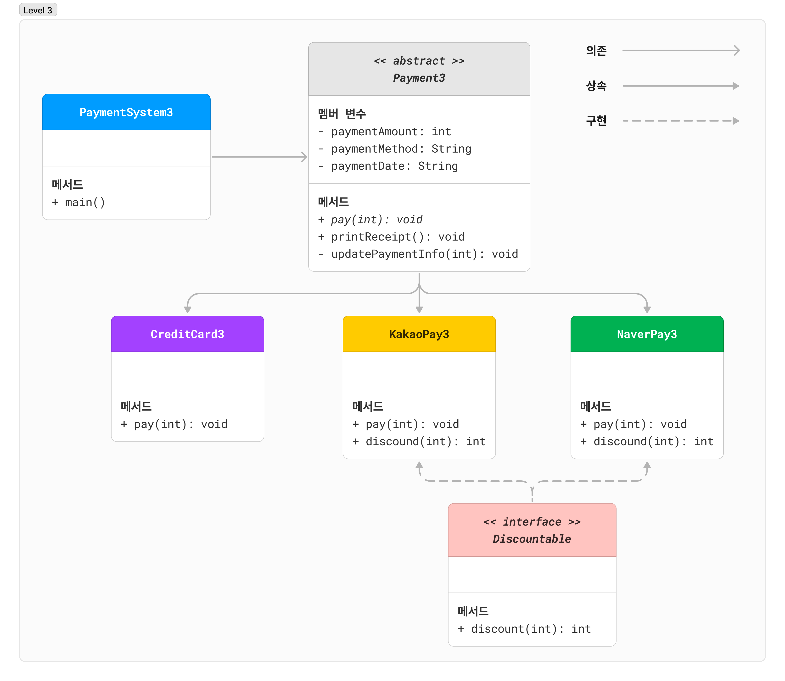

## 간단한 결제 시스템 개발하기 - LEVEL 3

마지막 단계까지 오시느라 고생하셨습니다! 이제 결제 시스템에 할인 기능을 추가해 봅시다.  
하지만 모든 결제 방식에 할인이 적용되지 않습니다. 카카오페이는 10% 할인, 네이버페이는 5% 할인을 진행한다고 합니다.

인터페이스를 도입해 할인 기능을 적용해 봅시다!

### 구조

### `Discountable` 인터페이스

#### 메서드

인터페이스는 `public abstract` 키워드가 자동으로 추가되기 때문에 따로 선언하지 않아도 됩니다! 수업 시간에 분명 배운 내용입니다 ㅎㅎ

- `int discount(int originalAmount)`: 할인 적용 (상속받는 클래스에서 구현해야 하는 <u>추상 메서드</u>)

### 직접 구현해 봅시다!

**이제 아래의 출력 예제를 보고 `PaymentSystem3`의 `main` 메서드를 완성하세요!**

